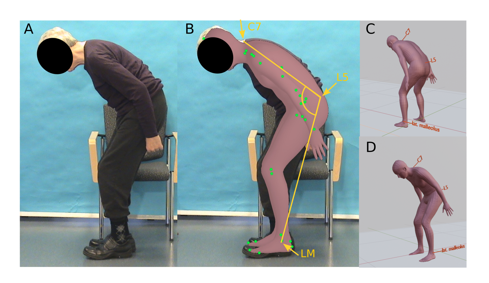

# Application of 3d human mesh recovery for the clinical documentation of Camptocormia

This is the accompanying respository for the paper "Application of 3d human mesh recovery for the clinical documentation of Camptocormia" by Wolke et al. The original pictures used to evaluate the approach for the estimation of the cmaptocormia bending angle as described in "Consensus for the measurement of the camptocormia angle in the standing patient" ([link](https://pubmed.ncbi.nlm.nih.gov/29907329/)) are not available due to data protection policy. The following code as evaluated using a Ubuntu 22.04 machine with an Nividia GTX 1050 8GB GPU.



# How to apply

1. Clone the PARE (Part Attention Regressor for 3D Human Body Estimation) respository ([link](https://github.com/mkocabas/PARE)) and follow the instructions to run the algorithm.

2. Read the instructions of get_angle.py to calculate the total-camptocormia angle.

3. To view the output in ([link] (https://www.blender.org)) use the tofbx.py conversion script in this respsitory (adapted from VIBE ([link](https://github.com/mkocabas/VIBE/blob/master/lib/utils/fbx_output.py)) and modified.

# Citation

If you find this work helpful please cite the following paper 
```
@still to be published

```
As this projects technically relies heavily on PARE please cite also
```
@inproceedings{Kocabas_PARE_2021,
  title = {{PARE}: Part Attention Regressor for {3D} Human Body Estimation},
  author = {Kocabas, Muhammed and Huang, Chun-Hao P. and Hilliges, Otmar and Black, Michael J.},
  booktitle = {Proc. International Conference on Computer Vision (ICCV)},
  pages = {11127--11137},
  month = oct,
  year = {2021},
  doi = {},
  month_numeric = {10}
}
```
